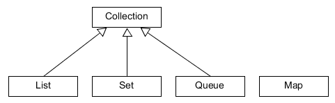
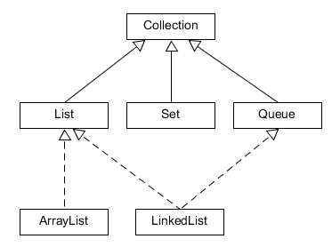

# List, ArrayList kontra LinkedList

## A Java Collections Framework

Amikor több objektum együttes kezeléséről beszélünk, valamilyen kollekcióra gondolunk. Láttuk, hogy a tömb nem a leghatékonyabb megoldás elemek tárolására. A Collections Framework olyan interfészeket és osztályokat tartalmaz, amelyek különböző módon segítik az elemek rendszerezését, kezelését, miközben mind biztosítja a kollekció méretének dinamikusságát.

Öt fő interfészt definiál:



A `List` jellemzője, hogy az elemeknek adott sorrendje van, index alapján elérhetőek és duplikált elemeket is tartalmazhat.

Ezzel szemben egy `Set`-ben az elemeknek nincs sorrendje, és duplikációt sem tartalmazhat.

A `Queue`-t akkor használjuk, ha az elemeket egy megadott sorrendben szeretnénk feldolgozni, mely lehet a beszúrás sorrendje, vagy valamilyen prioritás szerint meghatározott.

A `Map` kicsit különbözik a többitől, mert az elemei kulcs-érték párok, ahol a kulcsok mindig egyediek.

Minden interfészt több osztály is implementál, de közös jellemzőjük, hogy az `Object`-ben definiált `toString` metódust mind felülírja, hogy az a tárolt elemeket szöveges reprezentációjának sorát adja vissza.

### A `Collection` interfészben deklarált metódusok

`boolean add(E element)`: új elem hozzáadása.

`boolean remove(Object o)`: a megadott elem eltávolítása; igazzal tér vissza, ha volt olyan elem, amit el akartunk távolítani.

`int size()`: az elemek számát adja meg.

`boolean isEmpty()`: igazzal tér vissza, ha a kollekció elemszáma nulla.

`void clear()`: eltávolítja az összes elemet.

`boolean contains(Object o)`: megadja, hogy a paraméterként átadott elem megtalálható-e a kollekcióban.

## A `List` interfész és implementációi

A `List` interfészt implementáló osztályok közös jellemzője, hogy az elemek sorrendje adott, és mind befogad duplikációt. Hozzáférni bármelyik elemhez közvetlenül lehet az indexe segítségével, de hogy mely műveletek végezhetők el hatékonyabban, az az implementációtól függ.



### ArrayList

Az `ArrayList` osztály a háttérben tömbben tárolja az elemeket, ezért könnyen és gyorsan lehet az elemeket lekérdezni. Az elemek törlése és beszúrása a többi elem eltolásával jár, vagy akár az egész tömb nagyobb tömbbe átmásolásával, ezért ezek erőforrás igényesebb műveletek. A lista kapacitása tulajdonképpen a háttérben lévő tömb mérete, ezért ha előre tudjuk, hogy sok eleme lesz, érdemes eleve nagy kapacitással létrehozni. A lista telítettsége az elemek számának és a tömb méretének az aránya. Amikor a lista telítettsége elér egy bizonyos mértéket, akkor a kapacitás automatikusan megnő.

### LinkedList

A háttérben kétirányú láncolt lista áll, amit úgy kell elképzelni, mintha minden elem csak azt tudná, hogy hol van a következő és az előző, de az elemek fizikailag nem egybefüggő területen vannak a memóriában. Bármely elem lekérdezéséhez be kell járni a lista első vagy utolsó elemétől kezdve a keresett elemig az összeset, ezért ez erőforrásigényes művelet, viszont elem beszúrása vagy törlése nem jár elemmozgatással, ezért ez gyorsabb, mint `ArrayList` estében. A `Queue` interfészt is implementálja.

### List metódusok

`void add(int index, E element)`: új elemet szúr be a meghatározott pozícióra.

`E element(int index)`: elem lekérdezése az indexe alapján.

`int indexOf(Object o)`: megkeresi a paraméterben átadott elem első előfordulását, és az indexével tér vissza. Ha az elem nincs a listában, a visszaadott index -1.

`int lastIndexOf(Object o)`: megkeresi a paraméterben átadott elem utolsó előfordulását, és az indexével tér vissza. Ha az elem nincs a listában, a visszaadott érték -1.

`void remove(int index)`: törli a listából a megadott indexű elemet.

`E set(int index, E element)`: lecseréli a megadott indexű elemet a paraméterként átadottra, és a régi elemmel tér vissza.

## Ellenőrző kérdések

* Mi a Java Collections Framework? Milyen interfészeket tartalmaz? Milyen viszonyban állnak ezek egymással?
* Milyen közös metódusokat ismersz?
* Milyen tulajdonságai vannak a `List` interfésznek?
* Mi a különbség az `ArrayList` és a `LinkedList` között?
* Milyen további metódusai vannak a `List`-nek a `Collection` interfészhez képest?

## Gyakorlati feladat 1 - Lottó

Implementálj egy lottó gépet, ahol megadható a lottó típusa (ötös, hatos, stb.)
és az is, hogy hány számból válasszon (golyók száma).
Írj egy osztályt, amely létrehozza a golyókat (`List<Integer>` értékek), összekeveri, majd megcsinálja a "húzást",
azaz kiválaszt a lottó típusának megfelelő számú golyót, majd a kihúzott számokat növekvő sorba rendezi és úgy adja vissza.  
A húzást a `selectWinningNumbers(int lotteryType, int ballCount)` metódus végzi,
amely egy (`List<Integer>`) értéket ad vissza.

### Hibakezelés

Ha a `selectWinningNumbers(int lotteryType, int ballCount)` metódust rossz paraméterekkel hívták meg
 (több vagy ugyanannyi számot kellene kihúzni, mint amennyit generál), a metódus dobjon egy `IllegalArgumentException` kivételt.

### Megvalósítás

Maximálisan használjuk ki a megfelelő kollekció nyújtotta lehetőségeket!
A visszaadott számok pozitív egész számok, és nem lehetnek nagyobbak, mint amennyi golyó van.
A golyók számozása egytől kezdődik. Ugyanaz a szám nem szerepelhet kétszer.

publikus metódusok:
```java
public List<Integer> selectWinningNumbers(int lotteryType, int ballCount)
```

### Tippek

Nézz utána, hogyan lehet `List` típusok esetén az elemeket rendezni (mi ennek a feltétele?), a rendezettséget megszüntetni.

[rating feedback=java-collectionslist-lotto]

## Gyakorlati feladat 2 - Számsorsolás

Hasonlít a korábbi feladatra, itt is véletlen számok kihúzásáról van szó, ám más az implementáció.
A véletlen számok létrehozása azonos is lehet, de `ArrayList`  helyett itt `LinkedList` a konkrét implementáció.
A húzásnál használjuk ki azt, hogy a kapott `LinkedList` mint `Queue`  is kezelhető, és a `Queue` `poll()` metódusával szedhetők ki a nyerő számok.

### Hibakezelés

 Ha a `public Set<Integer> drawNumbers(int drawCount, int maxNumber)` metódust rossz paraméterekkel hívták meg  (több vagy ugyanannyi számot kellene kihúzni, mint amennyit generál),
  a metódus dobjon egy `IllegalArgumentException` kivételt.

### Megvalósítás

 A kapott List típust át kell alakítani Queue típussá (közvetlen cast nem lehetséges!) és a kihúzott számok   sorba rendezése TreeSet alkalmazásával történjen.

 publikus metódusok:
```java
 public Set<Integer> drawNumbers(int drawCount, int maxNumber)
```

[rating feedback=java-collectionslist-szamsorsolas]
