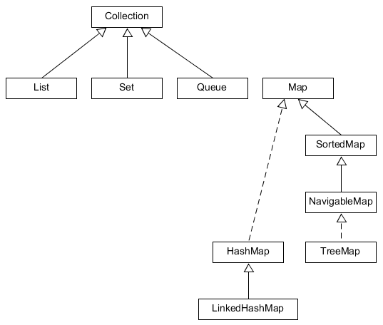

# Map

A `Map` kulcs-érték párok tárolását valósítja meg. Előnye, hogy az eltárolt érték a rá jellemző kulcs alapján nagyon gyorsan visszakereshető. A kulcs mindig egyedi kell legyen, és csak egyetlen érték társítható hozzá. A kulcs és az érték adattípusa a `Map` deklarációjakor generikusként adható meg. Mivel a két típus eltérhet egymástól, mindkettőt külön meg kell adnunk. Például a `Map<Integer, String>` deklaráció szerint a kulcs `Integer`, míg az érték `String` típusú. Ugyanazon kulcshoz csak egy érték tartozhat, de ez lehet akár kollekció is. A párok a `Map.Entry` interfészt implementálják, azaz mondhatjuk, hogy egy `Map<Integer, String>` kollekcióban `Map.Entry<Integer, String>` elemek vannak. Ebben az interfészben két metódus segíti külön a kulcs és külön az érték lekérdezését. A kulcsok halmaza és az értékek kollekciója külön-külön is kinyerhető a `Map`-ből. Három gyakran használt implementációja a `HashMap`, a `LinkedHashMap` és a `TreeMap`.

## `HashMap`

A kulcsokat `hashCode`-juk alapján kupacokba (*bucket*) szervezi, így az értékek megtalálása kulcs alapján ugyanolyan gyors, mint `HashSet` esetén. Az elemek sorrendje nem meghatározott. Elfogad `null` értéket kulcsként és értékként is.

## `LinkedHashMap`

A `HashMap` olyan változata, ahol a bejárás sorrendje állandó, és a beszúrás sorrendjét tükrözi. Megjegyzendő, hogy ha létező kulccsal szúrunk be új értéket, akkor az nem a map végére, hanem az eredeti bejegyzés helyére kerül.

## `TreeMap`

A map elemei keresőfába kerülnek, azért kulcs alapján rendezetten kapjuk vissza a bejegyzéseket. A rendezéshez a kulcsoknak összehasonlíthatónak kell lenniük, ezért a kulcs értéke sosem lehet `null`.

## `Map<K, V>` interfész metódusai

`int size()`: a `Map` bejegyzéseinek száma.

`boolean isEmpty()`: igaz, ha a `Map` mérete nulla.

`void clear()`: törli az összes bejegyzést.

`V get(Object key)`: a paraméterként átadott kulcshoz hozzárendelt értéket adja vissza, vagy `null`-t, ha a kulcs nem található a `Map`-ben.

`V put(K key, V value)`: új kulcs-érték pár beszúrása. Ha a `Map`-ben már létezett a kulcs, akkor a hozzárendelt értéket lecseréli az újra, és a régi értékkel tér vissza. Ha még nem létezett a kulcs, akkor új bejegyzést készít, és `null`-lal tér vissza.

`V remove(Object key)`: törli az adott kulcshoz tartozó bejegyzést. Ha a kulcshoz tartozott érték, akkor azzal tér vissza, ha nem tartozott, akkor `null`-lal.

`boolean containsKey(Object key)`: igazzal tér vissza, ha a megadott kulcs létezik a `Map`-ben.

`boolean containsValue(Object value)`: igazzal tér vissza, ha a megadott érték legalább egy kulcshoz hozzá van rendelve.

`Set<Map.Entry<K, V>> entrySet()`: a `Map` bejegyzéseinek halmazával tér vissza.

`Set<K> keySet()`: a kulcsok halmazát adja vissza.

`Collection<V> values()`: az értékek sokaságát adja vissza.

Az `entrySet()`, `keySet()` és `values()` műveletek által visszaadott kollekciók mögött ott van az eredeti `Map`, így ha bármelyik változik, az hatással van a másikra is. A visszaadott kollekciókon nem hívható meg az `add` és `addAll` művelet.

## Ellenőrző kérdések

* Miket tárolnak a `Map` interfész implementációi?
* Hogyan lehet végigiterálni az elemeken?
* Milyen implementációkat ismersz?
* Hogyan működik a `HashMap`?
* Milyen metódusokat ismersz?

## Gyakorlati feladat - Napló állomány elemzése

Gyűjtsd ki az ugyanahhoz az IP-címhez tartozó napló bejegyzéseket egy szöveges naplóból.
A napló sorokban tárolja az adatokat, egy sor egy `Entry` objektumnak felel meg,
IP cím, dátum és login mezőkből áll.
Írj egy log feldolgozást implementáló osztályt, `LogParser` néven, amely  elvégzi a dátum `String` konvertálását,
a sor feldolgozását, és `Map`-be szortírozását.
A fő tevékenységet a (`parseLog(String log)`) metódus végzi, amely egy (`Map<String, List<Entry>>`) értéket ad vissza.

### Hibakezelés

Ha a dátum String nem dolgozható fel, a metódus dobjon egy `IllegalArgumentException` kivételt.

Ha a `parseLog(String log)` metódus bemenete olyan `String`, amely nem dolgozható fel, mint `Entry` objektum,
szintén `IllegalArgumentException` kivételt dobjon.

### Megvalósítás

A sorfeldolgozáshoz szükséges adatok - elemek száma, pozíciója, mező szeparátor, dátum String formátuma -
statikus `final` változóként kerüljenek be a `LogParser` osztályba.

### Tippek

Ha a sor nem dolgozható fel, vagy a dátum nem konvertálható,
az egész feldolgozást töröljük és kivételt dobunk a probléma megjelölésével.

[rating feedback=java-collectionsmap-naploelemzes]

### Ellenőrző kérdés

Mi várható, ha nem `HashMap`, hanem `TreeMap` az implementáció? Mikor előnyös egyik, vagy másik?
