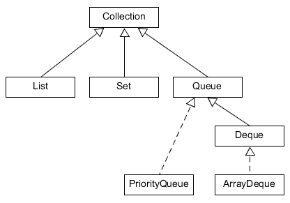

# Queue

A `Queue` olyan adatszerkezet, amely esetén az elemek hozzáadása és eltávolítása meghatározott sorrendben történik. Az eltávolítás sorrendje lehet

- a beszúrás sorrendje (FIFO - First In First Out) (sor),
- a beszúrás sorrendjével fordítottan (LIFO - Last In First Out) (verem),
- rendezettség esetén az elsőt (azaz "legkisebbet") először (prioritási sor).

A `Deque` interfész kiterjeszti a `Queue`-t, és elemek hozzáadását és kivételét a sor mindkét végénél lehetővé teszi (kétvégű sor). A sor elejét fejnek, a végét faroknak is hívják.

`Queue` implementációja a már megismert `LinkedList`, valamint a `PriorityQueue`, a `Deque` implementációja az `ArrayDeque`.



## `Queue` metódusok

A műveleteket két nagy csoportba sorolhatjuk. Az első csoportba azok tartoznak, ahol sikertelen művelet esetén kivételt kapunk, a másodikba azok, amelyek sikertelenség esetén valamilyen speciális értékkel (pl. `null`) térnek vissza.

|                     | Kivételt dob       | Speciális érték      |
| ------------------- | ------------------ | -------------------- |
| **Elem hozzáadása** | `boolean add(E e)` | `boolean offer(E e)` |
| **Elem kivétele**   | `E remove()`       | `E poll()`           |
| **Fej lekérdezése** | `E element()`      | `E peek()`           |

A beszúrás a végére, vagy prioritási sor esetén a sorrend által meghatározott helyére történik, a kivétel azonban mindig a sor elejéről.

## `Deque` metódusok

Amennyiben veremként (LIFO) kezeljük a kétvégű sort, akkor az alábbi műveleteket használhatjuk:

`void push(E e)`: elem hozzáadás a verem elejéhez

`E pop()`: elem kivétele a verem elejéről

A kétvégű sor mindkét végéhez adhatunk hozzá, és vehetünk ki onnan elemeket. Ehhez a `Queue` metódusainak `First` és `Last` végződésű változatait használhatjuk. Pl. `addFirst(E e)`, `peekLast()` metódusok.

## Ellenőrző kérdések

* Milyen jellemzői vannak a `Queue` interfésznek?
* Milyen implementációit ismered?
* Mit jelentenek a FIFO és LIFO fogalmak?
* Milyen metódusokat ismersz?

## Gyakorlati feladat 1 - JobDispatcher

A feladatokat `(job)` tetszés szerinti sorrendben felvisszük egy `PriorityQueue` típusú kollekcióba, és azt várjuk, hogy
mindig a soron következő legfontosabb feladatot adja ki.
Írj egy `JobDispatcher` osztályt, amely tárolja és rendezi a `Job` típusú objektumokat.   
A kollekció feltöltését a (`Queue<Job> addJob(Job... jobs)`) metódus végzi, amely egy (`PriorityQueue<Job>`) értéket ad vissza.
A soron következő feladatot a (`Job dispatchNextJob(Queue<Job> jobs) throws NoJobException`) metódus adja ki a queue-ból.

### Hibakezelés

Üres queue dobjon `NoJobException` kivételt.

### Megvalósítás

Hozz létre egy saját kivétel osztályt `NoJobException` néven, ezt akkor dobja a megfelelő metódus, ha a queue üres.

Hozzunk létre egy `Job` osztályt, a következők szerint:
Legyen 3 final attribútuma:

```java
int priority // 1 - 10 skálán osztályozzuk a prioritást
String jobDescription
boolean urgent // minden olyan job esetén true, ahol a prioritás < 5
```
Legyen egy `public Job(int priority, String jobDescription)` konstruktora.
Implementálja a `Comparable` interfészt, a kisebb számértékű prioritás van előbb a sorban.

### Tippek

A queue feltöltésekor használj varargs szerkezetet.
Így tetszés szerinti számú objektum átadható paraméterként.

[rating feedback=java-collectionsqueue-jobdispatcher]

## Gyakorlati feladat 2 - Deque implementáció

A `Deque` interfész egy kettős végű sor szerkezetet ír le, ennek az egyik implementációja az `ArrayDeque` kollekció.
A feladatokat most kétféle minősítéssel látjuk el, fontos az, amelynek a prioritása kisebb, mint 5 a többi nem fontos.
Fontos feladatok a sor elejére (head) `addFirst()` a nem fontosak a végére kerülnek `addLast()`. A feltöltés a fentivel azonos módon működhet.

### Hibakezelés

Üres queue dobjon `NoJobException` kivételt.

### Megvalósítás

publikus metódusok:

```java
public Deque<Job> addJobByUrgency(Job... jobs)
public Job dispatchUrgentJob(Deque<Job> jobs) throws NoJobException
public Job dispatchNotUrgentJob(Deque<Job> jobs) throws NoJobException
```

Az `ArrayDeque` implementáció rendelkezik `getFirst()` és  `getLast()` metódusokkal

### Tippek

Hozzunk létre egy `Job` osztályt, a következők szerint:
Legyen 3 final attribútuma:

```java
int priority // 1 - 10 skálán osztályozzuk a prioritást
String jobDescription
boolean urgent // minden olyan job esetén true, ahol a prioritás < 5
```
Legyen egy `public Job(int priority, String jobDescription)` konstruktora.
Implementálja a `Comparable` interfészt, a kisebb számértékű prioritás van előbb a sorban.

[rating feedback=java-collectionsqueue-dequeimplementacio]
