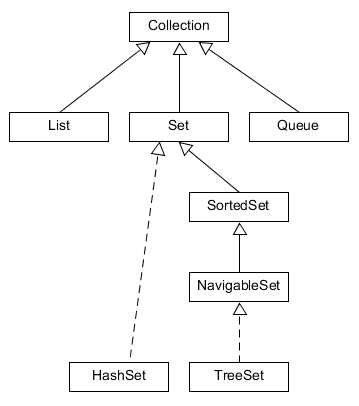

# `Set`

A `Set` megfelel a matematikai halmaz fogalmának, ezért nem enged meg duplikációt. Duplikációnak számít, ha a két elem esetén az `e1.equals(e2)` igazzal tér vissza. Két gyakran használt implementációja a `HashSet` és a `TreeSet`. Ez utóbbi a `NavigableSet`-et is implementálja. `Set`-et főként akkor használunk, ha a hangsúly pusztán a tartalmazáson van, az nem számít, hogy a keresett elem hányadik, vagy milyen "szomszédjai" vannak.



## HashSet

A `HashSet` az elemeket a `hashCode`-juk alapján úgynevezett *bucket*-ekbe, kupacokba sorolja, ezért a visszakeresés gyorsabb, mint lista esetén, hiszen ha megtaláltuk a megfelelő kupacot, akkor már csak az abban lévő elemeket kell átnézni. Nagyon fontos, hogy egy osztályban deklarált `equals()` és `hashCode()` metódusok betartsák a szabályokat, hiszen ha két egyenlőnek tekintett objektum nem ugyanazt a `hashCode`-ot adja vissza, akkor egy `HashSet`-ben sosem fogjuk megtalálni. Lehet benne `null` elem, de csak egyszer.

## TreeSet

A `TreeSet` az elemeket keresőfában tárolja, ezért képes azokat nagyság szerint rendezetten visszaadni. Ehhez persze az kell, hogy az elemek összehasonlíthatók legyenek egymással. Természetes rendezettsége van a számoknak és a `String` típusnak is, de saját osztályban is definiálhatunk rendezettséget. A `null` elem nem megengedett, hiszen ez nem hasonlítható össze a többivel.

## Ellenőrző kérdések

* Milyen tulajdonságokkal rendelkezik a `Set` interfész?
* Hogyan vizsgálja a duplikációt?
* Milyen implementációkat ismersz, miben térnek el ezek egymástól?

## Gyakorlati feladat 1 - `HashSet` alkalmazása

Szolgáltatásokat készítünk, egyrészt egy nagy elemszámú, random módon generált `String` kollekcióból akarjuk
 kiszűrni az egyedi elemeket, másrész két különböző `String` halmazból akarjuk kinyerni a közös elemeket.

A `StringsHandler` osztályban a következő publikus metódusok találhatók
(ezek persze a tesztesetekből is következnek):

```java
public Set<String> filterUniqueStrings(Collection<String> stringCollection)
public Set<String> selectIdenticalStrings(Set<String> setA, Set<String> setB)
```

* Feltételezzük, hogy a véletlenszerűen generált `String` objektumok között valamennyi azonos is található.
* Feltételezzük, hogy két (vagy több) egyénileg, véletlenszerűen generált `String` kollekcióban
számos azonos `String` található.

[rating feedback=java-collectionsset-hashset]

## Gyakorlati feladat 2 - `TreeSet` alkalmazása

Egy `String` tömbből akarjuk kiszűrni az egyedi elemeket,
és ezeket sorba is akarjuk rendezni, natív order, azaz itt abc szerint.

A `WordFilter` osztályban a következő publikus metódus található
(ez persze a tesztesetekből is következik):

```java
public Set<String> filterWords(String[] randomStrings)
```

### Megvalósítás

Használjuk ki a `TreeSet` rendezettségét.
A tesztelés során megvizsgáljuk a `Set` várható méretét, valamint a kollekció első és utolsó elemét!

[rating feedback=java-collectionsset-treeset]
