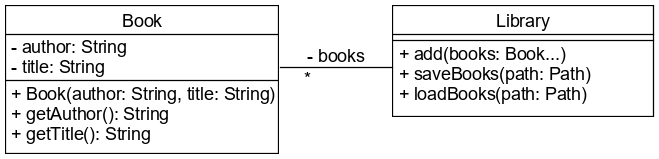

# Fájlkezelés tesztelése

A JUnit keretrendszer beépített támogatást nyújt a fájlkezelések tesztelésére. 
A `TemporaryFolder` objektum gondoskodik a mappák és fájlok ideiglenes létrehozásáról, 
majd a teszt lefutása után ezeket automatikusan törli.

Amennyiben a tesztelendő metódus a `Path` objektumot paraméterként kapja, akkor a tesztelés 
során a `TemporaryFolder`-rel létrehozott ideiglenes fájl vagy mappa könnyen átadható neki.

Tegyük fel, hogy az alábbi metódust kell tesztelni:

```java
public class EmployeeService {

  public void writeEmployeesToFile(List<String> employees, Path file) {
      try (BufferedWriter writer = Files.newBufferedWriter(file)) {
          for (String employee: employees) {
              writer.write(employee + "\n");
          }
      }
      catch (IOException ioe) {
          throw new IllegalStateException("Can not write", ioe);
      }
  }
}
```

Az elvárt működés az, hogy az átadott szöveglistából az alkalmazottak neveit a 
szintén paraméterben átadott fájlba írja, minden nevet külön sorba.

A tesztosztályban létre kell hozni egy `TemporaryFolder` típusú publikus attribútumot, 
melyet a `@Rule` annotációval kell ellátni. A teszt metódusban ennek segítségével létrehozunk 
egy fájlt reprezentáló `Path` objektumot a `newFile()` metódus által létrejött 
`File` átkonvertálásával, és azt adjuk át a tesztelendő metódusnak. A 
metódus lefutása után az elkészült fájlt például a `Files.readAllLines()` metódussal 
felolvassuk és összehasonlítjuk az elvárt tartalommal.

```java
public class EmployeeServiceTest {

    @Rule
    public TemporaryFolder temporaryFolder = new TemporaryFolder();

    @Test
    public void testWrite() throws IOException {
        Path file = temporaryFolder.newFile("employees.txt").toPath();
        System.out.println(file);
        List<String> employees = List.of("John Doe", "Jane Doe", "Jack Doe");
        new EmployeeService().writeEmployeesToFile(employees, file);

        List<String> content = Files.readAllLines(file);
        assertEquals(3, content.size());
        assertEquals("Jane Doe", content.get(1));
    }
}
```

## Ellenőrző kérdések

* Milyen JUnit osztály segíti a fájlkezelés tesztelését?
* Hogyan működik ez az osztály?
* Hogyan kell az osztályt használni a teszt esetben?

## Feladat

### Könyvtár

Készíts egy `Book` osztályt, amely a könyv címét és szerzőjét tartalmazza. 
A `Library` osztály a könyvek listáját attribútumként tárolja. Könyveket lehet 
hozzáadni az `add(Book...)` metódusával, mely csak azokat a könyveket adja a 
listához, amelyek még nem voltak benne. Az osztály aktuális állapotát szöveges fájlba lehet 
menteni, illetve fájlból be lehet tölteni az ott lévő könyveket.



Készítsd el a teszteket is a `Library` osztályhoz.

### Sajtok

Készíts egy immutable `Cheese` osztályt, mely a sajt nevét (`String`) és laktóztartalmát (`double`) tartalmazza. 
A `CheeseManager` osztályba készíts egy olyan `saveToFile()` metódust, amely a 
paraméterül kapott `Path` által reprezentált bináris fájlba menti a szintén 
paraméterül kapott `Cheese` lista tartalmát. A `findCheese()` metódusa a `Path`-ként 
kapott fájlban megkeresi név alapján a sajtot, és találat esetén egy `Cheese` 
objektumként adja vissza.

Készíts az elkészült `CheeseManager` osztály metódusaihoz teszteket!

