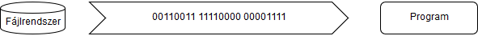
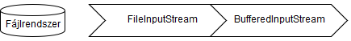

# Bájtok olvasása InputStreammel

Bináris állomány részletekben történő olvasásához `InputStream`-et használunk. Ekkor a 
közlekedő adatfolyam bájtok sorozata, nem pedig karaktereké.



Az `InputStream` absztrakt osztály melynek egy konkrét megvalósítása kérhető a 
`Files.newInputStream()` metódussal, amely egy `Path` onjektumot vár paraméterként. 
A kapott példányon át elérhetjük és olvashatjuk a fájlt. Amennyiben egyszerre szeretnénk 
a teljes tartalmat beolvasni a memóriába, használjuk a `readAllBytes()` metódust.

```java
Path file = Path.of("data.dat");
try (InputStream inputStream = Files.newInputStream(file)) {
    byte[] bytes = inputStream.readAllBytes();
    System.out.println(bytes.length);
}
catch (IOException ioe) {
    throw new IllegalStateException("Can not read file", ioe);
}
```

Amennyiben részletekben szeretnénk a fájlt olvasni, akkor erre a legalkalmasabb a 
`BufferedInputStream` használata, amely egyszerre több bájtot is képes beolvasni 
pufferelve. Ez egy magas szintű stream, mely az alacsonyabb szintű `FileInputStream` osztályra épül.



A `BufferedInputStream` használatához mindössze egy előre elkészített `byte[]` tömböt kell átadni a 
`BufferedInputStream` `read()` metódusának. A metódus feltölti a tömböt és visszaadja 
a beolvasott bájtok számát. A fájl végéhez érve ez eltérhet a tömb méretétől, ezért 
a visszaadott érték vizsgálata alkalmas annak ellenőrzésére, hogy van-e még adat a fájlban.

```java
Path file = Path.of("data.dat");
try (InputStream inputStream = new BufferedInputStream(Files.newInputStream(file))) {
    byte[] bytes = new byte[1000];
    int size;
    while ((size = inputStream.read(bytes)) > 0) {
        System.out.println(size);
    }
}
catch (IOException ioe) {
    throw new IllegalStateException("Can not read file", ioe);
}
```

## Java 8 előtti olvasás


A Java 8 verzió előtt a bináris fájlok olvasása nem sokban különbözött. 
Először egy `FileInputStream`-et kellett példányosítani a fájl elérhetőségével, 
amit a `BufferedInputStream` konstruktorának adtunk tovább. Az elkészült objektum 
használata már egyezik a fent megismerttel.

```java
InputStream inputStream = new BufferedInputStream(new FileInputStream(file))
```

```java
InputStream inputStream = new BufferedInputStream(new FileInputStream(new File(file)))
```

## Ellenőrző kérdések

* Hogyan lehet bináris fájlokat darabokban beolvasni a memóriába?
* Milyen magas szintű streammel metódussal lehet adott méretű darabot beolvasni? Hogyan működik?

## Feladat

### "A" betűk

Adott a `data.dat` állomány melyben rengeteg karakter található. A feladatod, hogy számold meg benne az "a" betűket, a videóban látott eszközök segítségével. 

### Mátrix

Ebben a feladatban egy mátrix adatszerkezettel kell dolgoznod. Hozz létre egy listát, 
ami byte tömbök tárolására alkalmas! Tárold el ebben a listában a `mátrix.dat` állományból 
beolvasott, minden 1000 bájtot tartalmazó byte tömböt!

Az állományban csak egyesek és nullák vannak. Írj egy metódust, ami visszaadja azon 
oszlopok számát, ahol több nulla, mint egyes van a mátrixban!

