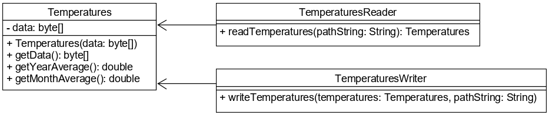

# Bájtok beolvasása fájlból és kiírása fájlba

Bináris állományok kezelésére is találhatunk metódusokat a `Files` osztályban. 
Ezek segítségével az állomány tartalma `byte[]`-be olvasható, illetve a fájlba `byte[]` 
közvetlenül írható.

A `Files.readAllBytes()` metódus csak a fájl elérhetőségét várja egy `Path` objektumban, és az 
abban található összes bájtot felolvassa és tömbként visszaadja. Hiba esetén 
`IOException` kivételt dob.

```java
Path file = Path.of("data.dat");
try {
    byte[] bytes = Files.readAllBytes(file);
    System.out.println(Arrays.toString(bytes));
}
catch (IOException ioe) {
    throw new IllegalStateException("Can not read file", ioe);
}
```

A `Files.write()` metódus alkalmas bináris állomány írására is, amennyiben 
második paraméterként `byte[]` típusú adatot adunk át.

```java
Path file = Path.of("data.dat");
try {
    Files.write(file, new byte[]{97, 98, 99, 100, 101});
}
catch (IOException ioe) {
    throw new IllegalStateException("Can not write file", ioe);
}
```

## Ellenőrző kérdések

* Hogyan lehet bináris fájl tartalmát beolvasni a `Files` osztállyal? Milyen 
típusú értékkel tér vissza a metódus?
* Hogyan lehet bináris fájlba `byte[]` típusú adatot kiírni?

## Feladat

### Hőmérsékleti statisztika

Az előző 365 nap hőmérsékleti adatait fájlban tároljuk. A `Temperatures` osztály 
attribútumában ezek találhatók egy `byte[]`-ben. Az osztály konstruktorban kapja meg 
a hőmérsékleti adatokat. A `getYearAverage()` metódusa a teljes év átlaghőmérsékletét 
adja vissza, a `getMonthAverage()` az utolsó 30 napét. Készíts egy `TemperatureReader` osztályt, 
mely egyetlen `readTemperatures()` metódusa bináris fájlból beolvassa az eltárolt 
hőmérsékleteket, és egy `Temperatures` példánnyal tér vissza! Ugyanennek mintájára készíts egy 
`TemperaturesWriter` osztályt, amelynek a `writeTemperatures()` metódusa a paraméterként kapott 
`Temperatures` példányból bináris fájlba írja a hőmérsékleti adatokat!



