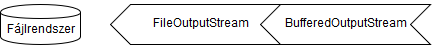

# Bájtok írása OutputStreammel

Bináris fájlok írásához az absztrakt `OutputStream` osztály egy megvalósítását 
kell használnunk. Alacsony szintű stream a `FileOutputStream`, melyet pufferelt 
íráshoz egy `BufferedOutputStream` példányba csomagolhatunk.



Megnyitás után a `write()` 
metódussal írhatjuk ki a paraméterként átadott `byte[]` típusú adatot. Az `OutputStream` 
objektumot le kell zárni, ezért try-with-resources szerkezetben nyitjuk meg. A megnyitás és az 
írás közben `IOException` kivétel keletkezhet, melyet megfelelően kezelnünk kell.

 ```java
Path file = Path.of("data.dat");
try (OutputStream outputStream = new BufferedOutputStream(Files.newOutputStream(file))) {
    for (int i = 0; i < 1100; i++) {
        outputStream.write("abcde".getBytes());
    }
}
catch (IOException ioe) {
    throw new IllegalStateException("Cannot write file", ioe);
}
```

# Java 8 előtti írás

A `Files.newOutputStream()` metódussal csak Java 8 óta lehet `OutputStream` 
objektumot előállítani, előtte a `FileOutputStream` konstruktorát nekünk 
kellett hívni egy `File` típusú objektumként vagy `String`-ként átadva a fájl elérhetőségét.

```java
OutputStream outputStream = new BufferedOutputStream(new FileOutputStream("data.dat"))
```

```java
OutputStream outputStream = new BufferedOutputStream(new FileOutputStream(new File("data.dat")))
```

## Ellenőrző kérdések

* Hogyan lehet bináris fájlt részletekben írni? Milyen osztályokat használunk ehhez?

## Feladat

### Szövegek írása bájt tömbként

Hozz létre egy `StringToBytes` osztályt és készíts benne egy `writeAsBytes()` metódust! A 
metódus a paraméterként kapott szöveg listából az "_" jellel kezdődő szövegeken kívül minden mást 
kiír a szintén paraméterül kapott path-ra bináris fájlba.

### Darabokban érkező kép

Hozz létre egy `ImageAssembler` osztályt, melyben a `makeImageFile()` metódus a 
paraméterben a kép részleteit `byte[][]`-ként kapja meg, majd a részeket kiírja 
egyetlen image.png nevű fájlba a `Path`-ként kapott mappába!

