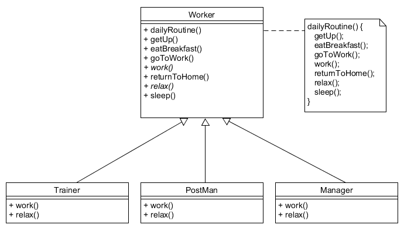

# Bevezetés a lambda kifejezések használatába

## Funkcionális nyelvek

A Java nyelv tisztán objektumorientált, azaz a program építőelemei az objektumok. A funkcionális nyelvek alap építő kövei a függvények. A deklaratív nyelvek csoportjába tartoznak, azaz a programozónak nem azt kell megmondani, hogy hogyan szeretné elérni a célját, hanem csak azt, hogy mit szeretne elérni. Legjobban a matematikai függvényekre hasonlít, mivel a bemenethez egyértelmű kimenetet rendel. Mivel állapotot nem tárol, nincs értékadás. Ebből következően nincs semmilyen mellékhatása, a függvényeket a program bármely pontján hívva ugyanazt az eredményt kapjuk.

## Funkcionális programozás Javaban

A Java 8-ban jelentek meg először funkcionális programozási elemek: lambda kifejezések és funkcionális interfészek.

A lambda kifejezés olyan kódblokk, amelyet paraméterként adhatunk át egy metódusnak. Tulajdonképpen egy névtelen metódus. Kollekciók esetén nagyon hasznos, például sorba rendezéskor egy egész `Comparator` objektum lecserélhető egyetlen lambda kifejezésre.

### Rendezés anonymous inner class Comparatorral

```java
trainers.sort(new Comparator<Trainer> {
    @Override
    public int compare(Trainer trainer1, Trainer trainer2) {
        return trainer1.getName().compareTo(trainer2.getName());
    }
});
```

### Rendezés lambda kifejezéssel

```java
trainers.sort((trainer1, trainer2) -> trainer1.getName().compareTo(trainer2.getName()));
```

## Template method tervezési minta

Amikor egy algoritmus sokféle objektumra nagyon hasonló, akkor elég lenne az algoritmus nagy részét megírni, a különbözőségeket kívülről kellene beadni. Ez objektumorientált nyelvek esetében azt jelenti, hogy egy ősosztály deklarálja az absztrakt metódust és az azt használó közös algoritmust, míg a leszármazottak mind implementálják az absztrakt metódust. A leszármazott lehet egy konkrét osztály vagy egy anonymous belső osztály.



A hiányzó rész tulajdonképpen csak egy metódus. Nem kellene egy egész osztályt létrehozni, elég lenne ezt megadni valahogy kívülről, például paraméterként. Ezt két módon tehetjük meg: vagy egy létező implementált metódust adunk át (metódus referencia), vagy egy lambda kifejezést, mely a hiányzó működést írja le.

## Lambda kifejezés szintaktikája

A lambda kifejezés két fő részből áll, melyeket `->` (nyíl operátor) választ el egymástól. Az első rész a bemenő paraméterek listája, a második rész a törzs, amely az utasításokat tartalmazza.

```java
(trainer1, trainer2) -> { return trainer1.getName().compareTo(trainer2.getName());}
```

A paraméterek típusa megadható, de nem kötelező. Pontosan egy paraméter esetén, ha a típust sem adjuk meg, a zárójel elhagyható.

```java
(Trainer trainer) -> {return trainer.getName();}
trainer -> {return trainer.getName();} 
```

A törzs `{}` közötti utasítások sorozata. Ha pontosan egy utasítást tartalmaz (amely legtöbbször egy return), a kapcsos zárójel, a `return` kulcsszó és a pontosvessző is elhagyható.

```java
trainer -> trainer.getName()
```

## Funkcionális interfész

Láthattuk az első példában, hogy mennyivel rövidebb és áttekinthetőbb lesz a kód, ha lambda kifejezést használunk. De mikor használhatunk lambda kifejezést paraméterként?

A *funkcionális interfész* olyan interfész, amely pontosan egy absztrakt metódust tartalmaz. Az interfész megjelölhető a `@FunctionalInterface` annotációval. Az így megjelölt interfész nem fordul le, ha nem egy absztrakt metódust tartalmaz.

A `Comparator` funkcionális interfész, mivel csupán a `compare` absztrakt metódust tartalmazza. A metódus két objektumot vár és `int` típussal tér vissza, ezért bármi olyan lambda kifejezés átadható `Comparator` helyett, amely két bemenő paramétert vár és `int` típussal tér vissza. Minden lambda kifejezés mögött egy funkcionális interfész áll, melynek absztrakt metódusát implementálja, ezért funkcionális interfész mindig kaphat lambda kifejezést értékül.

```java
Comparator<Trainer> comp = 
    (trainer1, trainer2) -> trainer1.getName().compareTo(trainer2.getName());
```

## Metódus referencia

Előfordul, hogy a lambda kifejezés nem új műveletet ír le, arra már létezik metódus. Ilyenkor átadhatjuk a metódust is lambda kifejezés helyett.

Szövegösszefűzés lambdával: `(str1, str2) -> str1.concat(str2)`

Ugyanez metódusreferenciával: `String::concat`

Az átadott metódus lehet statikus, konkrét objektumé vagy paraméterként átadott objektumé, illetve lehet konstruktor referencia is.

Az előző példában a paraméterként átadott str1-en hívja meg a `concat` függvényt str2 paraméterrel. A metódusreferencia nem statikus, de azt sem mondtuk meg, konkrétan melyik String-et kell használnia, azért az a paraméterként átadott objektumon fog meghívódni.

Ha mindig egy konkrét objektumot szeretnénk használni, akkor a metódus neve előtt nem az osztályt, hanem az objektumot kell feltüntetni. Például ha létezik egy `String str = "alma"` szövegünk, akkor a `str::concat` metódusreferenciánk mindig ehhez fűzi hozzá a paraméterként átadottat.

Konstruktor referenciát akkor használunk, ha új objektumot szeretnénk létrehozni a metódusból. Formátuma: `Osztály::new`

## Saját és beépített funkcionális interfészek

A Java nyelv számos funkcionális interfészt tartalmaz, de sajátot is készíthetünk. Amennyiben megfelel annak a szabálynak, hogy pontosan egy absztrakt metódust tartalmaz, akkor funkcionális interfész.

```java
public interface Condition<T> {
    boolean apply(T t);
} 
```

Az interfészt használhatjuk például arra, hogy egy lista elemei közül megtaláljuk az első feltételnek megfelelőt. Figyeld meg a template method tervezési mintát! A kereső algoritmus állandó, de mögötte a feltételt vizsgáló metódus implementációja cserélhető. Amiben biztosak lehetünk a keresés írásakor, hogy a `condition` paraméternek van `apply` nevű metódusa, ami most éppen egy `Trainer` objektumot kap és `boolean`-t ad vissza.

```java
public Trainer findFirst(List<Trainer> trainers, Condition<Trainer> condition) {
    for (Trainer trainer: trainers) {
        if (condition.apply(trainer)) {
            return trainer;
        }
    }
    throw new IllegalArgumentException("Cannot find trainer applied to the condition: " + condition);
} 
```

A keresési feltételt elég a `findFirst` metódus hívásakor definiálnunk. Például, ha a "John Doe" nevű `Trainer`-t keressük:

```java
findFirst(trainers, trainer -> trainer.getName().equals("John Doe")); 
```

### Beépített funkcionális interfészek

Attól függően, hogy hány és milyen típusú paraméter megy be, és milyen típussal tér vissza a metódus, többféle funkcionális interfészt készítettek el a Java fejlesztői, melyeket a `java.util.function` csomagban találunk meg. Ahhoz, hogy ezeket használni tudjuk, ismernünk kell a bennük található metódus nevét is.

| Interfész             | Paraméterek száma és típusa | Visszatérési típus | Metódus neve |
| --------------------- | --------------------------- | ------------------ | ------------ |
| `Supplier<T>`         | 0                           | T                  | `get`        |
| `Consumer<T>`         | 1 (T)                       | void               | `accept`     |
| `BiConsumer<T, U>`    | 2 (T, U)                    | void               | `accept`     |
| `Predicate<T>`        | 1 (T)                       | boolean            | `test`       |
| `BiPredicate<T, U>`   | 2 (T, U)                    | boolean            | `test`       |
| `Function<T, R>`      | 1 (T)                       | R                  | `apply`      |
| `BiFunction<T, U, R>` | 2 (T, U)                    | R                  | `apply`      |
| `UnaryOperator<T>`    | 1 (T)                       | T                  | `apply`      |
| `BinaryOperator<T>`   | 2 (T, T)                    | T                  | `apply`      |

Láthatjuk, hogy létezik a fenti funkciónak megfelelő beépített interfész a nyelvben, és ez a `Predicate`.  A generikus típusnak megfelelő paramétert kap, és logikait ad vissza. Ezt használva a fenti keresés:

```java
public Trainer findFirst(List<Trainer> trainers, Predicate<Trainer> condition) {
    for (Trainer trainer: trainers) {
        if (condition.test(trainer)) {
            return trainer;
        }
    }
    throw new IllegalArgumentException("Cannot find trainer applied to the condition: " + condition);
}
```

Csupán az interfész és a benne található metódus nevét kellett módosítanunk, a `findFirst` metódus hívása ugyanaz marad.

Ezek az interfészek csak objektumokkal tudnak dolgozni. Ha az a feladat, hogy egy listában található egész számokat összegezzünk, akkor erre a `Function<List<Integer>, Integer>` funkcionális interfészt használhatjuk. Primitív típusú adatokat sem befogadni, sem visszaadni nem tudnak, arra külön interfészeket hoztak létre. Nézz utána ezeknek!

## Ellenőrző kérdések

* Mik a jellemzői a funkcionális programozásnak? Mi az alapegysége?
* Melyik Java verzióban jelentek meg funkcionális elemek?
* Java nyelvben milyen eszköz van a funkcionális programozásra?
* Hogyan épül fel egy lambda kifejezés?
* Mi áll minden lambda kifejezés mögött?
* Hogyan tudsz saját funkcionális interfészt készíteni? Milyen szabályoknak kell megfelelnie?
* Milyen már beépített interfészeket ismersz?

## Bankszámlák lekérdezése

Készíts egy `BankAccount` osztályt `accountNumber`, `nameOfOwner` és `balance` attribútumokkal.
Készíts egy `BankAccounts` osztályt, mely konstruktorban `BankAccount` listát vár.

A metódusok rendre új listát készítenek, rendezik a következő szabályok alapján, és adják vissza.

* Rendezés bankszámlaszám alapján
* Rendezés rendelkezésre álló összeg alapján, de előjeltől függetlenül
* Rendezés rendelkezésre álló összeg alapján, az előjel számítson, de csökkenő sorrendben
* Név alapján, de ha a név megegyezik, akkor bankszámlaszám alapján. Amennyiben nincs kitöltve a név (értéke `null`,
elől szerepeljen)

### Implementációs javaslat

Kizárólag lambda kifejezéseket vagy method reference-eket használj.

Használd a következő metódusokat (persze a megfelelő paraméterezéssel): `Comparator.naturalOrder()`, `Comparator.comparing()`,
`Comparator.reversed()`, `Comparator.nullsFirst()`, `Comparator.thenComparing()`. 

[rating feedback=java-lambdaintro-bankszamlak]

## Fájlnevek

 Írj egy `OfficeDocumentReader` osztályt, abba egy `List<File> listOfficeDocuments(File path)`
 metódust, mely visszaadja a paraméterként átadott könyvtárban található összes `docx`, `pptx` és `xlsx`
 kiterjesztésű fájlt, név szerint sorbarendezve.

### Implementációs javaslat

 Kizárólag lambda kifejezéseket vagy method reference-eket használj.
 
 [rating feedback=java-lambdaintro-fajlnevek]

## Szülinapok

Írj egy `FamilyBirthdays` osztályt, mely konstruktor paraméterül kap születésnapokat. Implementáld benne
az `isFamilyBirthday` és `nextFamilyBirthDay` metódusokat, a
tesztben szereplő method reference-ek alapján.

A `isFamilyBirthday` visszaadja, hogy a paraméterként átadott dátum születésnap-e. A `nextFamilyBirthDay`
metódus visszaadja, hány nap van a legközelebbi születésnapig.

### Implementációs javaslat

Nézd meg `LocalDate` `query()` metódusát, hogy mit kap paraméterül. Használd a `ChronoUnit` osztályt annak meghatározására,
hogy két dátum között hány nap telt el.

## Közösségi háló

Hozz létre egy közösségi hálózatot, melyben a fejvadászok mindenféle műveletet tudnak végezni a tagokkal.

Hozz létre egy `Member` osztályt, `name`, `skills` (mely egy `List<String>`), `gender` és `messages` (`List<String>`) attribútumokkal.
Hozz létre benne egy `sendMessage(String)` metódust, mely a paraméterként kapott üzenetet beteszi a `messages` listába.

Hozz létre egy `SocialNetwork` osztályt, mely `Member` objektumokat képes tárolni.
A `findMembersBy()` metódusa a paraméterként átadott feltétel alapján kigyűjti a tagokat. A `applyToSelectedMembers()`
a paraméterként átadott feltételnek megfelelő tagokon végez valamilyen műveletet (2. paraméterként átadva).
A `transformMembers()` metódus minden tagon valamilyen transzformációt végez.

### Implementációs javaslat

Egy feltétel átadásához használj `Predicate` interfészt. Egy művelet átadásához használj `Consumer` interfészt.
Konvertáláshoz használj `Function` interfészt.

A `transformMembers()` metódus elég erősen használ generikust, nézd meg, hogy kell a metódusban definiálni, és
használni is generikust.