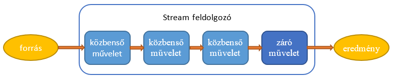

# Streamek

A streamek a Java nyelvben adatfolyamok. Úgy kell elképzelni, mint egy futószalagot, ahol sorban jönnek az adatok, és minden művelet csinál velük valamit. A közbenső műveletek (intermediate operations) eredménye szintén stream, így folytathatjuk a feldolgozást, míg a záró művelet (terminal operation) kimenete valamilyen kollekció vagy más objektum. A feldolgozás ún. lusta kiértékelésű (lazy evaluation), azaz a műveletek csak akkor hajtódnak végre, amikor szükség van rájuk, és csak azokon az adatokon, amelyeken feltétlenül szükséges. Az egész feldolgozást a záró művelet indítja el. E nélkül nem történik semmi,  az adatok a futószalag előtt várakoznak feldolgozásra.



A stream lehet véges vagy végtelen, attól függően, hogy hány adat van a forrásban. Ez persze nem jelenti azt, hogy végtelen adatot kell feldolgozni. Előfordulhat, hogy a kíván eredmény eléréséhez csak az első öt kerül a futószalagra.

## Stream létrehozása

A `java.util.stream` csomagban található `Stream` interfész metódusaival tudunk streameket létrehozni.

`Stream.empty()`: üres stream létrehozása.

`Stream.of(T... values)`: a felsorolt elemekből készít streamet.

```java
Stream<Integer> numbers = Stream.of(1, 2, 3);
```

`Stream.generate(Supplier<T> s)`: végtelen hosszú streamet generál a megadott `Supplier` segítségével.

```java
Stream<Double> randoms = Stream.generate(Math::random);
```

`Stream.iterate(T seed, UnaryOperator<T> f )`: végtelen streamet készít a megadott seed értéktől kezdve. A következő elemet mindig az előző elem és a paraméterként átadott függvény segítségével állítja elő.

```java
Stream<Integer> oddNumbers = Stream.iterate(1, n -> n + 2); 
```

Már létező kollekcióból is tudunk streamet gyártani a `Collection.stream()` illetve a `Collection.paralellStream()` metódusaival. A párhuzamos feldolgozású stream esetén a forrásból az elemek több ugyanolyan műveleteket tartalmazó futószalagra kerülnek, és csak bizonyos műveleteknél válnak ismét eggyé. Mivel a futószalagok sebessége eltérhet, nem tudhatjuk, hogy a záró művelethez milyen sorrendben érkeznek az elemek. Ez leszámítva a feldolgozás nagy mennyiségű adat esetén sokkal gyorsabb is lehet, mint soros stream esetén, ezért ha nem számít a sorrend, érdemes használni.

```java
List<String> list = Arrays.asList("a", "b", "c");
Stream<String> fromList = list.stream();
Stream<String> fromListParallel = list.parallelStream(); 
```

## Záró műveletek

A feldolgozást a záró művelet indítja, ezért záró műveletnek mindig lennie kell. A záró művelet után a stream megszűnik létezni, új művelet nem végezhető rajta. A záró műveletek között vannak redukciók, amelyek az egész streamből egyetlen objektumot, értéket gyártanak.

`long count()`: a stream elemszámát adja meg.

```java
Stream<String> s = Stream.of("monkey", "gorilla", "bonobo");
System.out.println(s.count()); // 3 
```

`Optional<T> min(Comparator<? super T> comparator)`: az elemek közül a paraméterként átadott `comparator` szerinti legkisebbet adja vissza 

`Optional<T> max(Comparator<? super T> comparator)`: az elemek közül a paraméterként átadott `comparator` szerinti legnagyobbat adja vissza.

```java
Stream<String> s = Stream.of("monkey", "ape", "bonobo");
Optional<String> min = s.min((s1, s2) -> s1.length() — s2.length());
min.ifPresent(System.out::println); // ape
```

`Optional<T> findAny()`: a stream egyik elemével tér vissza, ha van ilyen. Párhuzamos streamek esetén gyakran használjuk, ha mindegy, melyik elem kerül először feldolgozásra.

`Optional<T> findFirst()`: a stream első elemét adja vissza, ha van ilyen.

```java
Stream<String> s = Stream.of("monkey", "gorilla", "bonobo");
Stream<String> infinite = Stream.generate(() -> "chimp");
s.findAny().ifPresent(System.out::println); // monkey
infinite.findAny().ifPresent(System.out::println); // chimp
```

`boolean allMatch(Predicate<? super T> predicate)`: igaz, ha a stream minden eleme megfelel a paraméterként átadott predicate-nek.

`boolean anyMatch(Predicate<? super T> predicate)`: igaz, ha a stream valamelyik eleme megfelel a paraméterként átadott predicate-nek.

`boolean noneMatch(Predicate<? super T> predicate)`: igaz, ha a stream egyik eleme sem felel meg a paraméterként átadott predicate-nek.

```java
List<String> list = Arrays.asList("monkey", "2", "chimp");
Stream<String> infinite = Stream.generate(() -> "chimp");
Predicate<String> pred = x -> Character.isLetter(x.charAt(0));
System.out.println(list.stream().anyMatch(pred)); // true
System.out.println(list.stream().allMatch(pred)); // false
System.out.println(list.stream().noneMatch(pred)); // false
System.out.println(infinite.anyMatch(pred)); // true
```

`void forEach(Consumer<? super T> action)`: a stream minden elemén elvégzi a paraméterben megadott műveletet.

```java
Stream<String> s = Stream.of("Monkey", "Gorilla", "Bonobo");
s.forEach(System.out::print); // MonkeyGorillaBonobo 
```

A `reduce()` művelet a stream elemeit egyetlen értékké gyúrja össze a paraméterben megadott `accumulator` művelet segítségével. Mindig új objektumot gyárt az előző részeredmény és az `accumulator` művelet segítségével, míg el nem jut a végeredményig. Három variációja van:

`Optional<T> reduce(BinaryOperator<T> accumulator)`: üres stream esetén `Optional.empty`-vel tér vissza.

`T reduce(T identity, BinaryOperator<T> accumulator)`: az összesítést a `identity` értékkel kezdi, ezért üres stream esetén ezt adja vissza.

`<U> U reduce(U identity, BiFunction<U,? super T,U> accumulator, BinaryOperator<U> combiner)`: főleg párhuzamos streameknél használjuk. A párhuzamosan feldolgozott és az `accumulator` művelettel egyesített elemeket végül a `combiner` művelettel egyetlen végeredménnyé gyúrja.

```java
BinaryOperator<Integer> op = (a, b) -> a * b;
Stream<Integer> stream = Stream.of(3, 5, 6);
System.out.println(stream.reduce(1, op, op)); // 90 
```

A `collect()` a stream kimenetén megjelenő elemeket gyűjti össze és/vagy rendszerezi valamilyen kollekcióba.

`<R,A> R  collect(Collector<? super T, R, A> collector)`: az elemeket a megadott `collector` gyűjti össze.

`<R> R collect(Supplier <R> supplier, BiConsumer<R, ? super T> accumulator, BiConsumer<R, R> combiner)`: a `supplier` által szolgáltatott kollekcióba gyűjti az elemeket az `accumulator` függvény segítségével. Párhuzamos streamek esetén az esetlegesen létrejövő több kollekció eggyé kovácsolásában játszik szerepet a `combiner`.

Például ha az eredményt listába szeretnénk összegyűjteni, akkor azt három féle képpen tehetjük meg:

```java
stream.collect(ArrayList::new, List::add, List::addAll);
stream.collect(Collectors.toCollection(ArrayList::new));
stream.collect(Collectors.toList());
```

A `Collectors` osztály többféle kollekciót is tud szolgáltatni, akár szortírozni is tudja az elemeket valamilyen szempont szerint.

## Ellenőrző kérdések

- Mi a stream?
- Hogyan lehet streamet létrehozni?
- Hogyan dolgozzuk fel a streameket?
- Mit jelent az, hogy a stream kiértékelése lusta (lazy evaluation)?
- Sorolj fel öt záró műveletet! Mit csinálnak?

## Gyakorlat - Alapműveletek

Készíts egy `Numbers` osztályt, amely egész számokból álló listát tárol. A listát a konstruktoron át kapja meg. Készíts metódusokat az alábbi számítások elvégzésére:

- `min()`: a legkisebb szám,
- `sum()`: az elemek összege,
- `isAllPositive()`: megvizsgálja, hogy minden elem pozitív-e,
- `getDistinctElements()`: az összes különböző elemet pontosan egyszer tartalmazó kollekció.

Az összes metódus kizárólag stream műveleteket használjon.

[rating feedback=java-lambdastreams-alapmuveletek]

## gyakorlat - Könyvesbolt

Készíts egy `Book` osztályt a könyv címével, kiadási évével, árával, darabszámával! A konstruktor is ebben a sorrendben kapja meg az adatokat.

A `BookStore` osztály tartalmazza a könyvek listáját. A listát a konstruktorban kapja meg. Készítsd el benne az alábbi metódusokat streamek segítségével:

`getNumberOfBooks()`: a könyvek számát adja meg

`findNewestBook()`: a legújabb kiadású könyvet adja vissza

`getTotalValue()`: a könyvek összértékét adja meg

[rating feedback=java-lambdastreams-konyvesbolt]

### Bónusz feladat

Nézz utána a `Collectors` osztály `groupingBy()` metódusának, és készítsd el az alábbi metódust is!

`getByYearOfPublish(int year)`: adott évben kiadott könyvek listáját adja vissza

