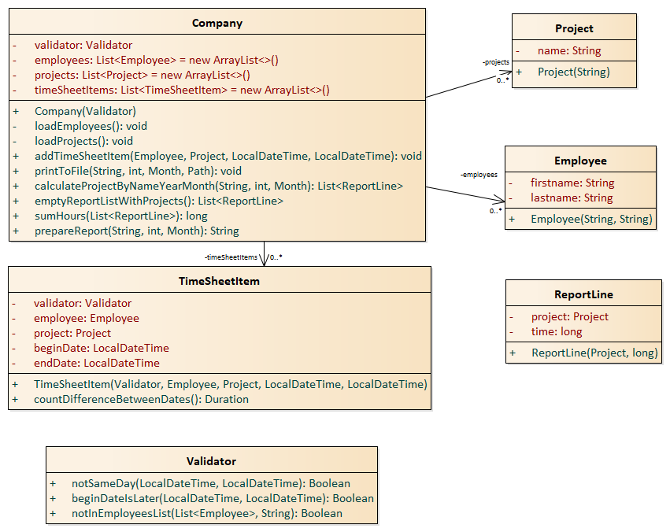

# Timesheet projekt

A feladatban egy cég munkaidő nyilvántartását kell megvalósítani. A cégen belül
vannak alkalmazottak illetve projektek. A cél, hogy az egyes alkalmazottak, egyes projekteken
végzett munkaidejét megfelelő formátumban egy fájlba kiírjuk. A várt formátumot megtalálod a tesztesetek expected adatai között.

## Részletes leírás

A projekteket és alkalmazottak neveit egy-egy fájlból kell beolvasni, (alkalmazottnál vezeték-, keresztnevet külön-külön) és ezeket el kell
a cégnek tárolnia, továbbá van egy nyilvántartása arról, hogy ki, melyik projekten dolgozott, 
mettől-meddig.
Fontos, hogy itt az időpontok mindig egy napra essenek, valamint a mikortól korábbi időpont legyen
mint a meddig, ezeket ellenőrizzük is validátor segítségével. Ilyen elemeket bármikor hozzáadhatunk a nyilvántartáshoz.
Ahhoz, hogy kiszámoljuk azt, hogy egy napon mennyi idő telt el a két időpont között érdemes használni
a `Duration` osztályt.

A projektek felsorolásánál csak azokat írjuk ki amin valóban dolgozott.
Fontos, hogy csak olyan alkalmazott adatait engedjük kiírni, aki valóban a cégnél dolgozik.

A megfelelő projekt-óra párok kialakításához segítségedre lehet egy kiegészítő osztály és ezeket az elemeket
tárolhatod egy listában. Ezt a listát érdemes először összeállítani, ahol a megfelelő projekt ideje folyamatosan
növelhető. 

A projekt megvalósításához frissítsd fel/nézd át a dátum és időkezelés téma fejezeteinek elméleti részét. A használandó osztályokról a tesztosztályok importjaiból kaphatsz támpontokat.

[rating feedback=java-newtimesheet]

