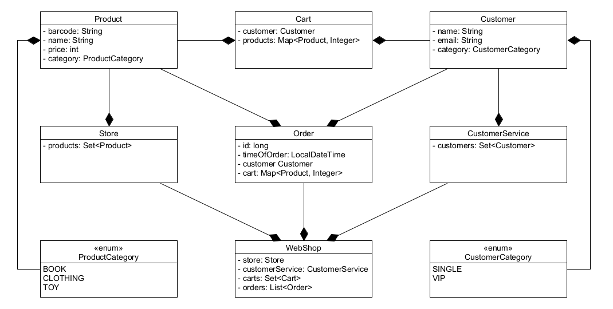

# Projektfeladat - Webáruház

A feladat egy webáruház alkalmazás modellezése a következő osztályok létrehozásával:

A `webshop` csomagba dolgozz!

* `Product` (termék): Attribútumai a vonalkód, név, ár, kategória (`ProductCategory` enum). Két terméket a
  vonalkód alapján tekintünk egyezőnek. Egy példányt ne lehessen üres adatokkal vagy negatív árral létrehozni!

* `ProductCategory`: Ez egy enum, `BOOK`, `CLOTHING` és `TOY` példányokkal létrehozva.

* `Customer` (vásárló): Attribútumai a név, email, kategória (`CustomerCategory` enum). Két vásárlót e-mail cím
  alapján tekintünk egyezőnek. Az osztály példányainak az e-mail cím alapján természetes rendezettsége van. Egy
  példányt ne lehessen üres adatokkal létrehozni! A vásárlók a létrehozásukkor automatikusan egyszerű (`SINGLE`)
  kategóriájú vásárlónak minősülnek. Az osztály tartalmaz egy metódust, amellyel át lehet állítani a vásárlói
  kategóriát `VIP`-re.

* `CustomerCategory`: Ez egy enum, `SINGLE` és `VIP` példányokkal létrehozva. Attribútuma: egy
  egész szám, amely megadja, hogy az egyes vásárlói kategóriáknak hány százalékos kedvezményt ad a webáruház
  vásárláskor (egy egyszerű vásárlónak nem jár kedvezmény, egy `VIP` törzsvásárló viszont 10% kedvezményt kap).

* `Store` (raktár): Attribútuma a termékek halmaza. Metódusai a következő funkciókat látják el:
  * Termék hozzáadása (a metódus a terméket várja paraméterül).
  * Egy metódus visszaadja a paraméterként megadott vonalkóddal rendelkező terméket. Ha nem talál ilyet,
    kivételt dob a megfelelő üzenettel.
  * Egy metódus visszaadja egy `Map<Category, List<Product>>`-ben, hogy kategóriánként milyen termékek vannak.
  * Egy metódus visszaadja a legolcsóbb terméket egy paraméterként megadott kategóriából.
  * Egy metódus visszaadja a termékeket egy listában, ár szerint rendezve, legolcsóbbtól a legdrágábbig.
  * Egy metódus visszaadja a termékeket egy listában, név szerint ábécé sorrendbe rendezve.

* `CustomerService` (vevőszolgálat): Attribútuma a vásárlók halmaza. Metódusai a következő funkciókat látják el:
  * Vásárló hozzáadása (a metódus a vásárlót várja paraméterül).
  * Egy metódus visszaadja egy listában a paraméterként megadott kategóriájú vásárlókat.
  * Egy metódus visszaadja a paraméterként megadott e-mail címmel rendelkező vásárlót. Ha nem talál ilyet,
    kivételt dob a megfelelő üzenettel.
  * Egy metódus visszaadja a vásárlókat egy listában, e-mail szerint rendezve.
  * Egy metódus visszaadja a vásárlók neveit egy listában, magyar ábécé szerint rendezve.

* `Cart`: Ez az éppen aktuális, megkezdett, de még be nem fejezett vásárlás. Attribútumai egy vásárló
  és egy vásárlói kosár (`Map<Product, Integer>` típusú: termékek és az azokból vásárolt mennyiségek). Két kosár a
  vásárló alapján minősül egyezőnek (ez azért fontos, hogy egy vásárlónak ne lehessen egyszerre két megkezdett vásárlása).
  Az osztály tartalmaz egy metódust, amellyel egy terméket lehet hozzáadni a kosár tartalmához. Ez paraméterként
  a terméket és a vásárolni kívánt mennyiséget várja. Ha már benne van ez a termék a kosárban, akkor
  csak annak a mennyiségét növeli.

* `Order`: Ez egy véglegesített megrendelés. Attribútumai egy id, a megrendelés időpontja, valamint egy vásárló és
  egy vásárlói kosár (`Map<Product, Integer>` típusú: termékek és az azokból vásárolt mennyiségek). Az osztály
  konstruktora mindegyik attribútum értékét paraméterül várja. Ne lehessen egy példányt üres adatokkal létrehozni!
  Az osztály metódusai:
  * Egy metódus visszaadja a vásárlás végösszegét. A végösszeg számításánál figyelembe kell
    venni, hogy a vásárlónak jár-e kedvezmény (a vásárlói kategóriájának megfelelően).
  * Egy metódus paraméterként egy terméket vár, és visszaadja, hogy a vásárló vásárolt-e az adott termékből.

* `WebShop`: Ez az osztály reprezentálja magát a webáruházat. Attribútumai a raktár, a vevőszolgálat,
  a megkezdett vásárlások halmaza és egy lista a véglegesített megrendelésekből. Az osztály metódusai
  a következő funkciókat látják el:
  * Termék hozzáadása (a metódus paraméterként a terméket várja, majd delegálja a kérést a `Store` osztály
    megfelelő metódusának).
  * Vásárló hozzáadása (a metódus paraméterként a vásárlót várja, majd delegálja a kérést a `CustomerService` osztály
    megfelelő metódusának).
  * Vásárlás elkezdése. A metódus egy vásárló e-mail címét várja paraméterül, kikeresi a vásárlót, majd
    létrehoz számára egy új vásárlást (`Cart`). Ez még csak egy elkezdett vásárlás, tehát módosítható vagy
    akár törölhető is később.
  * Legyen egy metódus, mellyel a vásárló terméket tud rakni a kosarába! Ez paraméterül a vásárló e-mail címét,
    a termék vonalkódját és a vásárolni kívánt mennyiséget várja. Ha nem talál az adott vásárlóhoz megkezdett
    vásárlást, dobjon kivételt! Akkor is kivételt kell dobni, ha a vásárolni kívánt mennyiség 1-nél kisebb szám.
  * Vásárlás elvetése. Paraméterként a vásárló e-mail címét kell megadni, és ez alapján a metódus törli az adott
    felhasználó megkezdett vásárlását a halmazból.
  * Megrendelés véglegesítése: A metódus a vásárló e-mail címét és a megrendelés időpontját várja paraméterül,
    létrehoz egy új `Order`-t, átmásolja bele a vásárló kosarának aktuális tartalmát, hozzáadja a véglegesített
    megrendelések listájához, majd visszatér a megrendelés id-jával.
    Id-t úgy készít a megrendelésnek, hogy lekéri annak a listában elfoglalt helyét (index + 1). A metódus törli az eddigi
    ideiglenes kosarat, valamint vizsgálja azt is, hogy a vásárlónak ez a hányadik vásárlása, ugyanis 5 véglegesített
    vásárlás után a vásárló kategóriáját `VIP`-re állítja, így a 6. vásárlástól kezdve jár majd neki a kedvezmény.
  * Egy metódus visszaadja egy halmazban, hogy mely felhasználók vásároltak egy bizonyos termékből (paraméterül a
    termék vonalkódját kell megadni, és csak a véglegesített megrendeléseket kell vizsgálni).
  * Egy metódus visszaadja egy `Map<Long, Integer>`-ben (vásárlás id és végösszeg), hogy egyes vásárlásoknál mennyi a
    vásárlás végösszege (csak a véglegesített megrendeléseket kell vizsgálni).
  * Egy metódus visszaadja a legtöbbet fizető vásárlót (csak a véglegesített megrendeléseket kell vizsgálni).
  * Egy metódus visszaadja egy listában a vásárlásokat a kifizetett végösszeg szerint, első helyre rakva a
    legnagyobb összegű vásárlást (csak a véglegesített megrendeléseket kell vizsgálni).
  * Egy metódus visszaadja egy listában a vásárlásokat a megrendelés dátuma alapján, elöl legyen a legfrissebb megrendelés
    (csak a véglegesített megrendeléseket kell vizsgálni).
  * Egy metódus paraméterként egy vásárló e-mail címét és egy termék vonalkódját várja, és visszaadja, hogy az a
    vásárló vásárolt-e az adott termékből (csak a véglegesített megrendeléseket kell vizsgálni).
  